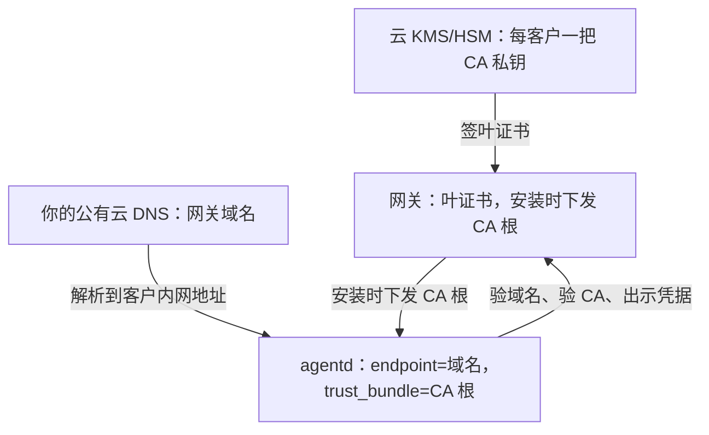

# wist-gateway 访问安全方案（控制面）

## 1. 文档目的

本文档固定「agentd 如何安全地访问网关」这一条链路的整体方案：信任模型、双方身份、证书体系、
命名与解析（DNS）、不可妥协的配置基线，以及网关损坏后的恢复口径。

它回答四个问题：

- agent 凭什么确信对面是真的网关
- 网关凭什么确信对面是那台机器
- 换一台网关机器，为什么可以不碰 agent
- 哪些东西一旦丢了，就必须逐个 agent 动手

**范围**：控制面（agentd → 网关 HTTPS）。**数据面不在本文档内**（见 §2）。

相关文档：

- [`../../../wist-agentd/docs/usage/README.md`](../../../wist-agentd/docs/usage/README.md) —— 运维排障
  （§2.3 网关看不到这台主机 / §2.4 换证书后全部 agent 掉线 / §3.2 换网关地址、重新注册）
- [`../../../wist-agentd/docs/design/agent-config-schema.md`](../../../wist-agentd/docs/design/agent-config-schema.md)
  —— `control_plane` 各字段（`endpoint` / `tls_mode` / `trust_bundle`）

> **现状标注约定**：**【现状】** = 代码已具备；**【待做】** = 本方案要求、今天还不具备。

---

## 2. 两条链路与信任模型

| 链路 | 走向 | 传输 | 在本文档内 |
| --- | --- | --- | --- |
| **控制面** | agentd → 网关 HTTPS | TLS（rustls） | ✅ 主体 |
| **数据面** | agentd → warp-parse（TCP）→ 网关 ingest | 明文 HTTP，只应绑环回 | ❌ 单独评估 |

数据面那条链路在配置里连 TLS 字段都没有（`LogsTcpOutputSection` 只有 `addr`/`port`/`framing`），
网关侧接入端点也注明「明文、只应绑环回」。所以**控制面的证书不覆盖它**；客户要求端到端加密时，
那一段要单独设计。

信任是**双向**的，而且两向的手段不同：

- **agent 认网关**：靠**域名**（证书 SAN）+ **CA 根**（`trust_bundle`）—— 与"哪台机器"无关
- **网关认 agent**：【现状】靠库里的 bearer 凭据；【待做】改成你自己的 CA 签的 agent 证书



---

## 3. 网关的身份：域名 + 你的 CA

| 要素 | 落点 | 规则 |
| --- | --- | --- |
| **名字** | **对外基址**（管理面「对外地址」设置，未设置时回落 `[server] public_base_url`），同时是 agentd 的 `control_plane.endpoint` | **域名就是网关的身份**，长期不改 |
| **信任锚** | agentd 的 `control_plane.trust_bundle` = **该客户的 CA 根** | 由安装命令自动带入，agent 端零操作 |
| **证书** | 每站一张叶证书（现场生成密钥、中央签发） | 形态见 §3.3 |

### 3.1 不变式

**对外基址** ＝ 证书 SAN ＝ agentd 的 `control_plane.endpoint`，**三者必须一致**。

推论：**域名不变，agent 永远不用重装。** 网关换机器、换 IP、换证书都不关 agent 的事
（证书由同一个 CA 签即可）。

⚠️ **对外基址是运行时设置（【现状】管理面 `agent_advertise_url`，未设置时回落
`server.public_base_url`），会把这条不变式拉松：**

- 改对外地址时**必须同步换一张 SAN 匹配的证书** —— 否则之后新装的 agent 会拿到一个跟证书
  对不上的 endpoint，握手直接失败，而症状只是「连不上」（与 §6.3 同一类难查）。
- 它**只影响之后签发的安装代码与新装 Agent**；已安装的 agent 要重跑安装脚本才会拿到新值
  （初始配置只在安装时拉一次）。
- 所以：改域名/对外地址 ≠ 改 DNS 记录。**改 DNS 记录对 agent 无感；改对外基址必然要重发安装命令。**

> 换域名时**尽量不重装 agent** 的需求与方案（别名保留 / 下发控制面端点 / 回退）：见
> [`gateway-domain-change.md`](./gateway-domain-change.md)。

### 3.2 为什么用你自己的域（而不是客户的域）

| 方案 | 记录谁改 | 客户是否要配 | 主要问题 |
| --- | --- | --- | --- |
| **你的域**（推荐） | 你 | 否 | 客户内网编址会出现在你的 zone 里（提前对齐即可） |
| 客户的域 | 客户（或给他们 API） | 一次 | `xyz.com` 常是客户的 AD 域名 → 内网另有一份 zone，可能被遮住，要维护两份 |
| 委派子域 | 你 | 一次（NS 委派） | 名字是客户的、记录你管；仍受解析器过滤影响 |

**决定性的差异只有一条**：客户内网**永远不会**托管你的域，所以你的域名不会被 split-horizon 遮住；
用客户的域则有可能，而那种问题会把你拖回客户的 DNS 团队。

### 3.3 证书形态（写错 rustls 就拒收）

服务端证书必须是**合法叶证书**：

| 扩展 | 值 | 写错的后果 |
| --- | --- | --- |
| `basicConstraints` | `critical,CA:FALSE` | 带 `CA:TRUE` → rustls 报 `CaUsedAsEndEntity`，agent 侧只看到"连不上" |
| `keyUsage` | `critical,digitalSignature,keyEncipherment` | 握手失败 |
| `extendedKeyUsage` | `serverAuth` | 握手失败 |
| `subjectAltName` | `DNS:<域名>`（与 endpoint 完全一致） | rustls 客户端按 hostname 校验，不匹配直接拒 |

- `tls_cert_file` 可以放**全链**（叶 → 中间证书），加载时按顺序全部读入。
- 私钥支持 PKCS#8 / PKCS#1 / SEC1。
- 【现状】**证书只在网关启动时加载** → 换证书必须重启网关。agent 侧无感（认的是 CA 根）。

### 3.4 agent 只认 `trust_bundle`

agentd 走 reqwest + **`webpki-roots`（Mozilla 内置根，编译进二进制）**，
**不看操作系统的钥匙串**。所以：

- 「往 macOS / Windows 系统里装个内部 CA」对 agentd **无效** —— 内部 CA 必须走 `trust_bundle`。
- 反过来：**「浏览器信」不等于「agent 信」** —— 管理台能打开，不代表 agent 能连上。
- 反过来也成立：私有 CA 的根**不需要**在公网受信列表里（这正是私有 CA 的意义）。

---

## 4. 证书体系：每客户一把 CA，私钥在云 KMS/HSM

| 决策 | 理由 |
| --- | --- |
| **每客户一把 CA**（不是一把全局） | 隔离爆炸半径：一家泄露只波及一家；终止合作 = 销毁他那把 CA |
| **私钥托管在云 KMS/HSM**（形态与选型见 §4.2） | 不可导出、不会因机器损坏而丢、每次签名有审计、过 FIPS 评审 |
| **根设长期（10 年）** | 根一换 = **那一家**全部 agent 重装；这个日期要进交付档案 |
| **现场生成叶密钥，中央只签 CSR** | 私钥不出那台机器；中央没有共享私钥 |
| **预签 1–2 张备用叶证书** | 签发依赖云可达；离线 / 灾难恢复时用得上（agent 认根不认叶，备用证书哪张都能用） |

### 4.1 发证流程（三点）

1. **一次性**：为该客户创建一把 CA（私钥在 KMS/HSM 内，永不出）。
2. **每站**：在客户那台网关上现场生成密钥与 CSR → 中央签出该站名的叶证书 → 装上 → 重启网关。
3. **下发信任锚**：CA 根 PEM 填进网关 `[agent] trust_bundle`，管理面生成的安装命令会自动内嵌它，
   写进每个 agent 的 `agentd.toml`。

### 4.2 选型：先确认能力，再挑产品

三种形态，**名字不重要，能力才重要**：

| 形态 | 判断标志 | 代价 |
| --- | --- | --- |
| **托管私有 CA**（AWS ACM PCA 这类；阿里云在「数字证书管理服务」下；腾讯云待确认） | 控制台能「创建 CA」+「用 CSR 签发证书」 | 最省事，首选 |
| **KMS 非对称密钥 + 签名 API** | 能建 RSA/ECC 密钥并调签名接口 | 轻，但要自己拼 X.509（签 TBS → 组装证书） |
| **云加密机 + PKCS#11** | 给密码机实例 + PKCS#11 客户端库 | 最对口、控制最全，但要写胶水 |

### 4.3 要确认的四件事（无论选哪种）

1. **算法**：必须能签 **RSA / ECDSA（P-256/384）** 的证书 —— agentd 是 rustls，**不认国密 SM2**。
   只支持国密的方案在这条链上直接走不通。
2. **密钥不可导出，且换设备/迁移时能不能随迁？** —— 最要命的一条：**换设备若等于换根，
   就是那家全部 agent 重装**，这个资产的"长期性"就没了。
3. **签名接口**：PKCS#11 还是厂商私有 API/SDF —— 有 PKCS#11 才能直接用 OpenSSL 3 的 pkcs11
   provider 或 step-ca，否则要自己接。
4. **配额、高可用、计费**：每客户一把 → CA/密钥的数量配额；单实例挂了怎么办。
   另外：**必须能导出根证书 PEM**（要填进 `trust_bundle`）。

### 4.4 层级：每客户一把根，还是共享根 + 每客户子 CA

| 方案 | 隔离 | 轮换影响面 | 管理成本 |
| --- | --- | --- | --- |
| **每客户一把根**（推荐） | 最强 | 只影响一家 | N 把根，可自动化 |
| 共享根 + **每客户子 CA** | 中（根共享） | **根轮换 = 全体重装** | 最好管 |

因为「根是唯一不可重建的资产、根一换就全家重装」，默认取隔离优先；只有在供应商的 CA 配额/计费
不允许每客户一把时，才退成「共享根 + 每客户子 CA」，并接受根轮换是全局事件。

### 4.5 别把「持牌 CA 签证书给你」当成私有 CA

| | 私有 CA（PCA） | 持牌 CA（如「腾讯云 CA」） |
| --- | --- | --- |
| 根证书 | **你的**，只有你的 agent 认 | **供应商的**（合规/受信根） |
| 私钥 | 你指定的 HSM/KMS | 供应商的，你碰不到 |
| 每客户隔离 | 有 | 无（所有客户共享同一个根） |
| 你的核心资产 | CA 私钥 | 不存在（变成依赖对方服务） |

用持牌 CA 的证书**不是「省事版私有 CA」，而是换了一种信任模型**：省掉自建，但失去每客户隔离，
也失去「CA 私钥可离线保管」这个唯一不可重建的资产。真要省事可以选它，但本文档里「每客户一把
CA、CA 私钥当长期资产」那几节要相应改成「依赖第三方 CA 的服务条款」。

### 4.6 跨云可以（例：部署在腾讯云，CA 用阿里云 PCA）

**可以，而且 gateway 与 agent 都不需要知道。** 因为 agent 只认域名 + 根证书：

- gateway 只拿到叶证书文件，不访问任何云；
- agent 只认 `trust_bundle` 里的根 PEM，不访问任何云；
- **唯一需要出网的是签发侧**（把 CSR 换成证书的那个服务）—— 它要能调到 PCA 的接口
  （公网 API，或专线/VPN）。

用阿里云 PCA 的大致五步：开通私有证书（PCA）→ 建私有根 CA（RSA/ECC）→ 用 **CSR 签发**叶证书 →
导出根证书 PEM 填进 `[agent] trust_bundle` → 每站一条命令装证书并重启网关。

要确认的三条：**① 支持「上传 CSR 签发」吗**（支持则叶私钥永不出客户现场，最理想）；
**② 根/子 CA 的数量配额与计费**（决定能不能每客户一把）；**③ 能导出根证书 PEM 吗**（必须能）。

跨云的代价只有两条，写进交付说明即可：**签发依赖跨云可达**（配「预签备用叶证书」兜底）、
以及客户会问 **「为什么我的证书签在别家云」**。

### 4.7 加固与兜底

- **加固【待验证】**：给该客户的 CA 加 Name Constraints，限定它只能签自己那个名字。
  上线前**必须先确认 rustls 会强制执行**（历史上这块有过缺口）；不强制的话它是纸面约束，
  反而给人虚假的安全感。判据用本仓既有的同源校验测试。
- **兜底**：预签备用叶证书进交付包；KMS 密钥开删除保护、IAM 最小权限
  （KMS 只提供审计，**审批要自己设计** —— 谁能调签名 API，谁就能签任意名字）。

### 4.8 落地前的最小验证

在真机上走一遍：**HSM/KMS 里生成密钥 → 签一张 `c-001.gateway.dayu.com` 的叶证书 →
用本仓的**链式**同源校验测试确认 rustls 接受**（信任锚单独给 —— 就是 agent `trust_bundle` 的形态）：

```bash
WIST_GATEWAY_TLS_CHAIN=<叶证书> WIST_GATEWAY_TLS_ANCHOR=<CA 根> \
WIST_GATEWAY_TLS_SERVER_NAME=c-001.gateway.dayu.com \
  cargo test --offline --lib -- --ignored rustls_accepts_gateway_chain --nocapture
```

⚠️ **别用 `rustls_accepts_gateway_certificate` 验 CA 签的叶证书**：那条模拟的是「信任锚就是叶证书
本身」（自签形态），对 CA 签的叶必然判 `UnknownIssuer`，与真实 agent 的结论**相反**。

这一步过了，剩下的（每站签发、轮换、备用证书）都只是流程自动化；过不了就先解决问题，别往下铺。

> 本节涉及的具体产品名与能力边界（阿里云/腾讯云各自提供什么、是否支持 CSR 签发、配额与价格）
> 以厂商当前文档与售前答复为准。

---

## 5. agent 的身份：现状与目标

| | 【现状】 | 【待做】目标 |
| --- | --- | --- |
| 载体 | 库里一条 **bearer token** | **你自己的 CA 签的 agent 证书（mTLS）** |
| 换网关后 | 要逐台人工 `enroll`（或靠备份够新） | **自动，零人工** |
| 轮换 | 续期即换 token → 对备份时效敏感 | 按站吊销 |

【现状】的细节与代价：

- 契约里字段已预留（`CredentialBundle.certificate` / `private_key_ref` / `ca_bundle`），
  但 agentd 只认 `bearer`，其它 scheme 直接拒；网关侧目前是 `with_no_client_auth()`。
- **续期会换发新凭据**（新 id + 新 token，旧 token 随即作废），续期窗口是到期前 7 天左右。
  所以**数据库备份越旧，恢复后要人工 `enroll` 的 agent 越多**。
- **过渡措施（便宜，先做）**：备份保持小时级；或让续期不轮换 token（旧 token 留宽限期）。
  两者都能把"要逐台动手"的尾巴缩到很小。

【现状】的好消息：`agent_id` 是机器标识的**稳定哈希**，所以重新注册**不会产生重复 agent**，
`work-{agent_id}-{family}` 也不变。

---

## 6. DNS 与命名（设置细则）

### 6.1 记录形态

```dns
; 每客户一条，指向该客户现场那台网关的内部地址
c-001.gateway.dayu.com.   60   IN   A   10.12.3.4
c-002.gateway.dayu.com.   60   IN   A   10.12.9.9
```

- 名字里的 `c-001` 就是客户标识；**证书 SAN 必须与它完全逐字一致**。
- 若各站约定用同一个内部地址，可以退化成一条通配记录
  `*.gateway.dayu.com. A 10.12.3.4`（你自己这边也零维护）。
- 记录值与真实地址不符时，agent 会觉得"连不上"——**不会**静默采错数据（TLS 名字校验兜住）。

### 6.2 TTL 与迁移

- **TTL 设短：60–120 秒。** 迁移窗口按 TTL 计。
- agentd 每次轮询都新建 HTTP 客户端（进程内没有 DNS 缓存、也没有跨轮询的连接复用），
  所以**记录一改，下一个轮询周期（≤30 秒）就跟着新地址走**。
- 迁移步骤：
  1. 新地址就位；**证书不换**（同一张叶证书与地址无关）；
  2. 切 DNS 记录；
  3. 旧地址**保留一段时间**（≥10 分钟，覆盖解析器缓存与一个轮询周期），别立刻下电；
  4. 验证：抽几台客户机看 `last_seen_at` 是否继续推进。

### 6.3 私网地址出现在公网 zone：两条已知风险

1. **客户解析器可能丢弃「公网 DNS 返回私网地址」的应答**（DNS rebinding 防护）。
   这是唯一无法从你这侧预先验证的风险。**默认走公网记录**；被挡住的客户单独加一条内网
   stub 转发或 hosts 兜底（例外处理，不是默认方案）。
2. **记录会陈旧**：客户改了网段、或你迁移后忘了改记录 → 失败只出现在客户现场。
   对策是**对账**：让 agent 上报它实际连到的对端地址，管理面与记录并排显示，不一致就报警。

### 6.4 装前自检（在 agent 那台机器上跑）

```bash
getent hosts c-001.gateway.dayu.com       # 期望解析到该站网关的内部地址
curl -sk -o /dev/null -w '%{http_code}\n' \
  https://c-001.gateway.dayu.com/api/v1/agent/install/arm/install.sh
```

- 第一条错 → §6.3 的两条风险，就地判定。
- 第二条非 `200` → 网络/端口/网关未起；`-k` 只跳过 CA 校验，安装那一跳本来就靠证书指纹钉住。

### 6.5 别这么做

| ❌ | 为什么 |
| --- | --- |
| 把 `endpoint` 写成 IP | 网关一迁移就得重发全部安装命令（域名才是那个"不变"的东西） |
| 用 `/etc/hosts` 当默认方案 | 会被别的工具覆盖；只当"被解析器挡住"的单客户兜底 |
| 为你的域在客户内网建整个 `dayu.com` 的区 | 会遮住公网 zone 的其它记录；要建就只建 `gateway.dayu.com` |
| 记录值不设 TTL 或设一天 | 迁移时客户一天转不过来 |

---

## 7. 不可妥协的配置基线

1. **`tls_mode` 永远不用 `none`。** 这是整套信任模型的地基 —— 用了它，"DNS 被改也伪造不了网关"
   这条性质就没了。
2. **`trust_bundle` 必须是 CA 根，不是叶证书。** 这是"叶证书轮换对 agent 透明"的唯一条件。
3. **叶证书形态与 SAN 必须正确**（§3.3），否则 rustls 拒收，而 agent 侧只看到"连不上"。
4. **管理面浏览器要导入客户 CA**（一次）。同一张证书也在开管理台；这跟 agent 那条链路无关。
5. **改对外地址必须同步换证书。** 对外基址是**运行时**设置（管理面「对外地址」），
   而证书的 SAN 是签出来的 —— 两者不同步就会让之后新装的 agent 拿到一个跟证书对不上的
   endpoint（§3.1）。
6. **反代场景要留意限流**：网关限流按对端 socket IP、且故意忽略 `x-forwarded-for`
   （因为它可伪造）→ 所有 agent 会共用一个限流桶。
7. 排障判据：**别用 `curl --cacert` 的成败下结论**（curl 比 agent 用的 rustls 宽松），
   以网关日志的握手告警或同源校验测试为准。

---

## 8. 资产与灾难恢复

### 8.1 网关短时不可用（分钟到小时）

**什么都不用做。** agent 按手上那份工作清单继续采（本机 `state/work.json`），数据在本地排队、
重连回放；唯一受影响的是**你下不去新指令**（授权、暂停、撤回、升级）。

### 8.2 资产清单

| 资产 | 在哪 | 丢了会怎样 | 怎么保 |
| --- | --- | --- | --- |
| **CA 私钥** | 云 KMS/HSM | 不可重建 → **该客户全体重装** | 删除保护 + IAM 最小权限 + 签名审计 |
| **域名 / DNS 控制权** | 你的云 DNS | 全体重装 | 按长期资产持有，别放客户域 |
| **客户号 → CA → 名字 对应表** | 你的库 / 交付档案 | 无法轮换 | 定期导出 |
| **网关数据库** | 网关 | agent 要逐台重新注册（**不用重装**） | 小时级冷备（DB + 证书 + 配置） |
| 站上的叶私钥 | 各站磁盘 | 重签一张即可 | 不用备份（耗材） |

### 8.3 网关整机重建（最坏情况：什么都没备份）

1. 新机器起网关：配置 + 内容目录文件（它们是文件，不是库）+ **同名证书**。
2. 管理面给每台 agent 生成一次性注册 token，在那台机器上
   `sudo wist-agentd enroll --token <token>` 后重启服务。
3. 每台重做一次**用途判定**（授权的前置），等事实重新上来后采用建议 → 重新授权各采集面
   （内容由目录 + 事实派生，结果与之前一致）。
4. 网关本机那份原文日志 / 指标历史：**回不来**。

---

## 9. 分期落地

| 阶段 | 做什么 | 解决什么 |
| --- | --- | --- |
| **今天** | ① 定下"用你的域 + 每客户 CA"，并按 §4.2–§4.3 选定 CA 形态（托管私有 CA / 云加密机自建）；② 网关数据库例行备份；③ 客户侧解析自检进交付流程 | 把最大的坑先堵上 |
| **近期** | ④ 续期不轮换 token（或宽限期）；⑤ 对端地址对账；⑥ 证书到期上报 | 把"要逐台人工重注册"的尾巴基本消掉 |
| **之后** | ⑦ agent 证书（mTLS）：身份锚从数据库转移到 CA；⑧ 验证 rustls 是否强制 Name Constraints | 换网关对 agent 变成一次 DNS 变更 |

> 其中「换名字也不必重装 agent」这一条，已单列成需求与方案：见
> [`gateway-domain-change.md`](./gateway-domain-change.md)（状态：需求与方案已定，暂不实现）。

---

## 附录 A：与代码的对应

| 事项 | 位置 |
| --- | --- |
| `tls_mode` 取值与默认推断、trust_bundle 加载 | `wist-agentd/src/control/enrollment.rs`（客户端构造） |
| agentd 只接受 `bearer` 凭据 | `wist-agentd/src/control/enrollment.rs`（凭据 scheme 判定） |
| 续期窗口 7 天 | `wist-agentd/src/control/enrollment.rs`（`CREDENTIAL_RENEWAL_WINDOW`） |
| 网关配置校验（https、证书文件存在、trust_bundle 非空） | `src/infra/config.rs`（`validate`） |
| 安装地址由**对外基址**拼出（管理面设置优先，回落 `public_base_url`） | `src/api/install.rs`（`effective_advertise_base`）、`src/api/admin_ops.rs`（`advertise-url` 端点） |
| 安装码内嵌 `control_endpoint` + `trust_bundle`、curl 指纹钉住 | `src/api/install.rs` |
| 叶证书形态要求（`CA:FALSE` / `serverAuth` / SAN） | `wist-gateway-stack/dev/start-gateway.sh` |
| 证书链加载、无客户端认证 | `src/infra/tls.rs`（`with_no_client_auth`） |
| 证书只在启动时加载 | `src/main.rs` |
| 续期换发新凭据 | `src/api/agent_ops.rs`（`renew_agent_credential`） |
| `agent_id` 是机器标识的稳定哈希 | `src/api/enrollment.rs` |
| 限流按对端 IP、忽略 `x-forwarded-for` | `src/api/rate_limit.rs` |
| 数据面输出无 TLS 字段 | `wist-contracts/src/agent_config.rs`（`LogsTcpOutputSection`） |
| agentd 只信内置根（webpki-roots），不看 OS 钥匙串 | `wist-agentd/Cargo.toml`（reqwest 的 `webpki-roots` feature） |
| 同源证书校验：锤=叶 / 链式（锤单独给） | `src/infra/tls.rs`（`verify_certificate_as_rustls_client` / `verify_chain_as_rustls_client`） |
| 运维排障（证书/重新注册） | `wist-agentd/docs/usage/README.md` §2.3 / §2.4 / §3.2 |

## 附录 B：交付前验收清单

- [ ] 证书是合法叶证书，SAN 与**对外基址**逐字一致（用同源校验器验证，不用 curl）
- [ ] `[agent] trust_bundle` 是 **CA 根**，不是叶证书
- [ ] **对外基址**是 **https + 域名**，且与 agentd 的 `endpoint` 一致；若改过，证书已同步换新
- [ ] DNS 记录存在、TTL 短、在 agent 那台机器上能解析到该站网关地址
- [ ] 记录值指向的是那台网关（不是客户网里的同名地址）
- [ ] 客户解析器**不**丢弃私网应答（被挡的客户已记录例外）
- [ ] 备用叶证书已进交付包
- [ ] 网关数据库与证书的备份已就位、且知道怎么恢复
- [ ] 交付档案里记了：客户号、CA 标识别、域名、根证书有效期
- [ ] **（一次性）** CA 形态已定，并已按 §4.8 跑通最小验证（HSM/KMS 签出一张叶证书，
      `rustls_accepts_gateway_chain` 判定 rustls ACCEPTS）
